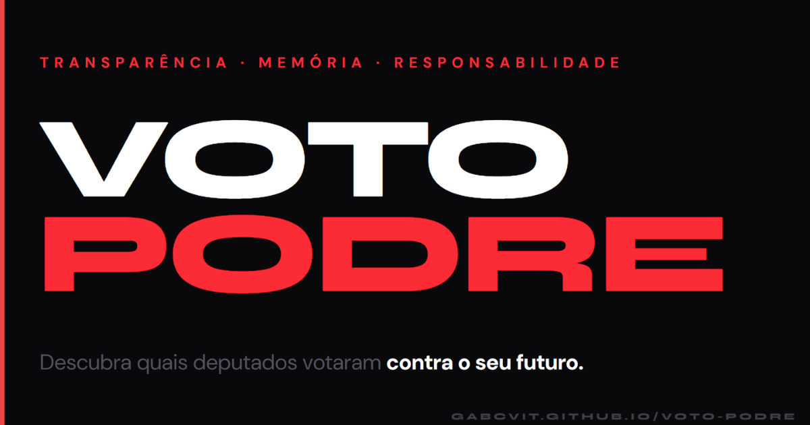

# Voto Podre



**Transparência · Memória · Responsabilidade**

Voto Podre é um projeto de transparência eleitoral que monitora os 513 deputados federais brasileiros e identifica aqueles com votos questionáveis em proposições catalogadas. Os dados são extraídos da [API pública da Câmara dos Deputados](https://dadosabertos.camara.leg.br/).

🔗 **[voto-podre.com.br](https://voto-podre.com.br)**

---

## Funcionalidades

- **Listagem de deputados** com busca por nome, filtro por partido, estado (UF), status ("podre" / "limpo") e quantidade mínima de pautas
- **Perfil individual** de cada deputado com seus dados, botões de redes sociais (com identificação da plataforma) e pautas em que teve voto questionável
- **Catálogo de pautas** com descrição detalhada e lista de todos os deputados flagrados
- **Glossário de termos** com explicações simples para siglas e conceitos legislativos (ex.: PEC, PL, proposição)
- **Estatísticas** em tempo real: total de deputados monitorados, pautas catalogadas e deputados flagrados
- **Tema escuro/claro** com preferência persistida em `localStorage` (escuro por padrão)
- **Navegação responsiva** com menu burger para dispositivos móveis
- **SEO completo** com meta tags Open Graph, Twitter/X Card e sitemap estático

## Pautas Catalogadas

| Proposição | Tipo | Temas | Descrição resumida |
|---|---|---|---|
| **PEC da Bandidagem** | PEC | democracia | Proposta que blinda parlamentares investigados de processos no STF |
| **PEC do Estupro** | PEC | direitos humanos | Proposta que criminaliza o aborto em todas as circunstâncias, incluindo estupro e risco de vida |
| **PL da Devastação** | PL | meio ambiente | Projeto que desmonta o licenciamento ambiental e abre caminho para desastres como Mariana e Brumadinho |
| **PL da Anistia** | PEC | democracia | Anistia partidos de multas eleitorais e irregularidades, inclusive por caixa 2 |
| **PL 490/2007 e marco temporal** | PL | meio ambiente, direitos humanos | Impõe o marco temporal e ameaça territórios indígenas |
| **PL 709/2023 contra movimentos trabalhistas rurais e indígenas** | PL | direitos humanos | Criminaliza ocupações do MST e comunidades indígenas |
| **PL 182/2024 e mercado de carbono** *(positiva)* | PL | meio ambiente | Deputados que votaram **contra** o marco regulatório do mercado de carbono |
| **PLP do Arcabouço Fiscal** | PLP | meio ambiente, saúde, educação | Amarra investimentos públicos em saúde, educação e infraestrutura |
| **PEC 169/2019 da Pejotização de Professores** | PEC | educação | Abre caminho para a pejotização e desvalorização de professores da rede pública |
| **Programa Agora Tem Especialista** *(positiva)* | MP | saúde | Deputados que votaram **contra** a expansão de especialistas no SUS |

---

## Stack

| Camada | Tecnologia |
|---|---|
| Framework | Vue 3 (Composition API, `<script setup>`) |
| Linguagem | TypeScript |
| Build | Vite |
| Estilo | Tailwind CSS v4 |
| Estado | Pinia |
| Roteamento | Vue Router v5 |
| Testes | Vitest + `@vue/test-utils` + Cypress |
| Deploy | GitHub Pages (`gh-pages`) |

## Rodando localmente

```bash
# Instalar dependências
pnpm install

# Servidor de desenvolvimento
pnpm dev

# Build de produção
pnpm build

# Rodar testes unitários
pnpm test:unit

# Rodar testes E2E (inicie o servidor antes em outro terminal)
pnpm dev
pnpm test

# Atualizar redeSocial dos deputados a partir da API da Câmara
pnpm sync:deputados:rede-social

# Deploy para GitHub Pages
pnpm deploy
```

## Testes

- `pnpm test:unit` executa a suíte Vitest para composables, componentes compartilhados e views com mais lógica interativa.
- `pnpm test` e `pnpm test:e2e` executam o Cypress em modo headless (`cypress run`). Requerem o servidor de desenvolvimento em execução (`pnpm dev` em outro terminal).
- A suíte E2E está dividida entre `cypress/e2e/smoke.cy.ts` (cobertura de todas as rotas públicas) e `cypress/e2e/interactions.cy.ts` (fluxos reais de navegação, filtros, tabs, compartilhamento e cópia da chave PIX).
- Em CI, o pipeline executa primeiro `pnpm test:unit` e só depois roda a suíte E2E com `cypress-io/github-action@v7`, que inicializa o servidor automaticamente em Node 24.x.
- O job de build só roda depois dessa sequência, então o deploy só ocorre se os testes unitários e E2E passarem.

---

## Aviso

Este repositório reflete uma perspectiva crítica sobre votações parlamentares e busca promover o engajamento eleitoral informado com base em dados públicos. As classificações das pautas representam a posição editorial do projeto.